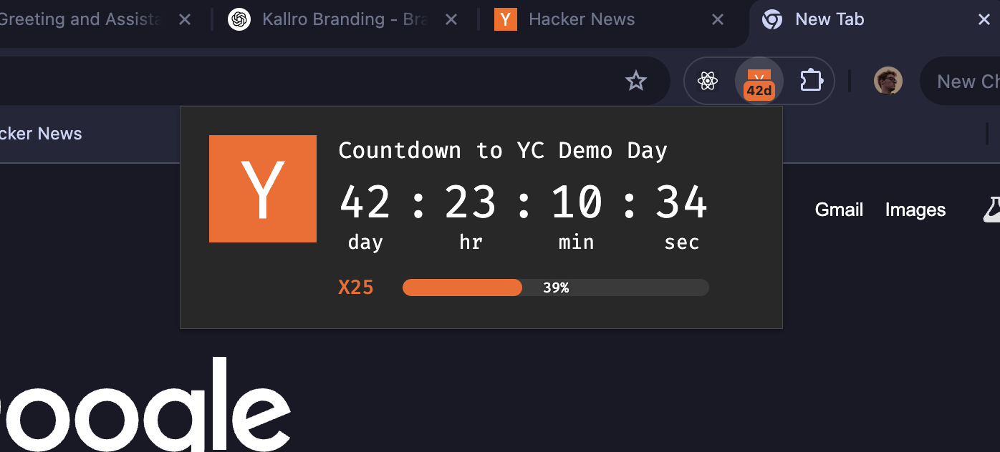

# YC Demo Day Countdown Extension

A Chrome extension that counts down to Y Combinator's Demo Day on June 11, 2025. Perfect for YC founders in the X25 batch or anyone tracking the YC timeline.

## Features

- Clean, minimalist countdown display showing days, hours, minutes, and seconds
- Progress bar tracking your journey through the X25 batch
- Badge showing days remaining directly on the extension icon
- Milestone notifications at key points (100 days, 50 days, 30 days, etc.)
- Celebration when Demo Day arrives!

## Screenshots
- An image of the popup and includes the badge display. 

## Installation (Chrome Developer Mode)

Since this extension isn't on the Chrome Web Store, you'll need to install it in developer mode:

1. **Download the extension**:
   - Clone this repository or download it as a ZIP file and extract it
   - `git clone https://github.com/yourusername/yc-countdown-ext.git` or download the ZIP

2. **Open Chrome Extensions page**:
   - Open Chrome and navigate to `chrome://extensions/`
   - Or go to Menu (three dots) → More Tools → Extensions

3. **Enable Developer Mode**:
   - Toggle on "Developer mode" in the top-right corner

4. **Load the extension**:
   - Click "Load unpacked"
   - Select the folder containing the extension files

5. **Pin the extension** (may or may not need):
   - Click the puzzle piece icon in Chrome's toolbar
   - Find the YC Demo Day Countdown extension and pin it

## Usage

- Click the extension icon to see the detailed countdown
- The extension badge shows days remaining until Demo Day
- You'll receive notifications at milestone days
- The progress bar shows how far along you are in the X25 batch

## For YC Founders

If you're in the X25 batch, this extension helps you stay focused on your Demo Day goal. The countdown serves as a constant reminder to make every day count on your startup journey!

## Feedback & Contributions

Feel free to fork, submit PRs, or suggest improvements!
